# QNXT Health Project — Metadata-Driven Data Platform (Azure Data Factory + Databricks)

An end-to-end, **metadata-driven** data engineering demo for a multi-hospital healthcare
network. It ingests relational data from an internal hospital system (**PostgreSQL** on Neon)
alongside recurring file-based feeds from external partners (**CSV** on ADLS Gen2), then
transforms everything through a **Bronze → Silver → Gold medallion architecture** on
**Databricks (PySpark + Delta Lake + Unity Catalog)**.

The key design idea: **one reusable ADF pipeline ingests every source** — relational or
file-based — driven entirely by rows in SQL control tables. Onboarding a new source means
**adding a row to a table, not writing a new pipeline**. Every run is audited per table and
reported by email automatically via **Azure Logic Apps**.

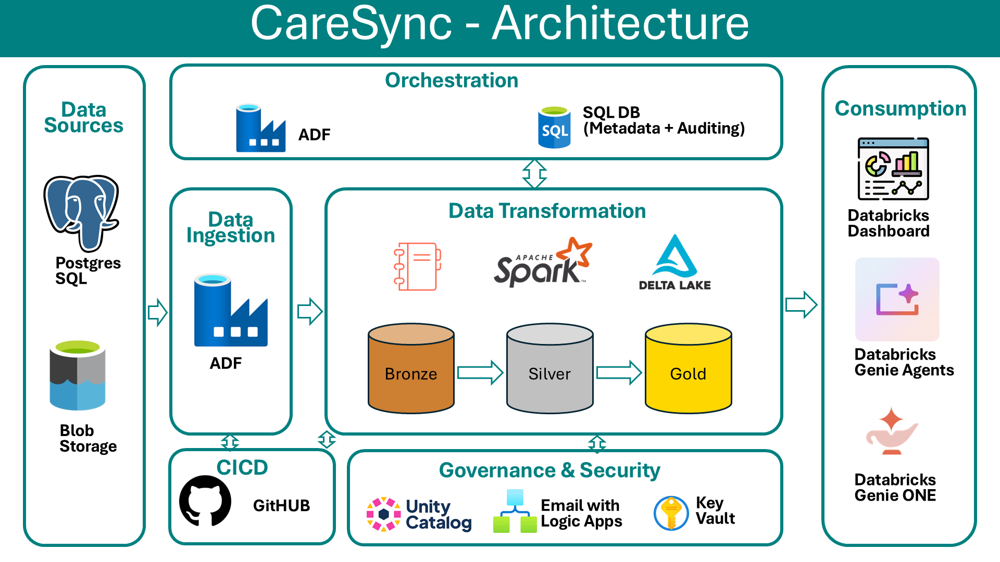

---

## Architecture overview

```
SOURCES                          INGESTION (ADF)                    STORAGE / TRANSFORM (Databricks)
─────────                        ───────────────                    ──────────────────────────────
Neon Postgres ──┐
  hospitals     │   Copy (PostgreSqlV2 → Parquet)
  doctors       ├──▶ ADLS landing/ ──▶ Landing_To_Bronze ──▶ bronze.* ──▶ Bronze_To_Silver ──▶ silver.*
  patients      │      (parquet)          (notebook)                      (FULL/APPEND/MERGE)
                │
ADLS source/ ───┘   Copy (Binary → Binary)
  lab_results.csv ──▶ ADLS landing/ ──▶ Landing_To_Bronze ──▶ bronze.* ──▶ Bronze_To_Silver ──▶ silver.*
  insurance_providers.csv  (csv)

silver.* ──▶ Gold notebooks (Spark SQL, CTAS) ──▶ gold.patient_360
                                                   gold.hospital_daily_summary
                                                   gold.lab_test_trends
                                                        │
                                                        ▼
                                              AI/BI Dashboards + Genie

ORCHESTRATION: PL_Master_QNXTHealth (daily schedule trigger)
  ├─ PL_Source_To_Silver_Main[neon_postgres] → PL_Source_To_Silver_Inner (per table)
  ├─ PL_Source_To_Silver_Main[adls_csv]     → PL_Source_To_Silver_Inner (per table)
  ├─ PL_Silver_To_Gold                      → gold notebooks (per gold table)
  └─ PL_Send_Email                          → Logic App → status email

GOVERNANCE: ctrl.table_config / ctrl.watermark / ctrl.audit_log (Azure SQL) drive and record every run.
SECURITY:  Azure Key Vault holds all secrets; Unity Catalog storage credentials for ADLS access.
```

---

## Repository structure

```
QNXT-Healthcare-adf-databricks/
│
├── README.md                          # This file
│
├── adf/                               # Azure Data Factory Git-integrated repo
│   ├── factory/
│   │   └── adf-qnxt-healthcare.json   # Factory definition + global parameters
│   │                                  # (email_recipients, env, logic_apps_URL)
│   ├── linkedService/
│   │   ├── LS_ADLS.json               # ADLS Gen2 (qnxthealthcarestorage)
│   │   ├── LS_AzureDatabricks.json    # Databricks workspace (PAT via Key Vault)
│   │   ├── LS_AzureKeyvault.json      # Key Vault (qnxt-keyvault)
│   │   ├── LS_PostgreSql.json         # Neon Postgres source (password via Key Vault)
│   │   └── LS_SQLdb_QNXT.json         # Azure SQL control DB (password via Key Vault)
│   ├── dataset/
│   │   ├── DS_SQLServer.json          # Azure SQL control tables (generic)
│   │   ├── DS_PostgreSql.json         # Postgres source tables (generic)
│   │   ├── DS_ADLS_Parquet.json       # Parquet in landing/ (container + folder params)
│   │   └── DS_ADLS_CSV_Binary.json    # CSV files in source/ (container + folder params)
│   ├── pipeline/
│   │   ├── PL_Master_QNXTHealth.json      # Master orchestrator: silver stage → gold stage → email
│   │   ├── PL_Source_To_Silver_Main.json  # Per source_system: read config → fan out per table
│   │   ├── PL_Source_To_Silver_Inner.json # Per table: copy → bronze → silver → audit + watermark
│   │   ├── PL_Silver_To_Gold.json         # Per gold table: run gold notebook + audit
│   │   └── PL_Send_Email.json             # Build status email → POST to Logic App
│   ├── trigger/
│   │   └── TGR_QNXT_Health_DAILY.json # Daily 2:35 PM Pacific → PL_Master_QNXTHealth
│   ├── publish_config.json
│   └── README.md
│
├── Databricks/                        # Databricks Repos folder (PySpark / Spark SQL)
│   ├── Source_to_Silver_Notebooks/
│   │   ├── Landing_To_Bronze.ipynb    # Generic: landing files → bronze Delta (append)
│   │   ├── Bronze_To_Silver.ipynb     # Generic: bronze → silver (FULL / APPEND / MERGE)
│   │   ├── Calendar Table.ipynb       # Builds silver.calendar date dimension (1940–2030)
│   │   └── Testing_the_data.ipynb     # Ad-hoc validation queries (dev/testing only)
│   ├── Gold/
│   │   ├── NB_patient_360.ipynb          # gold.patient_360 (CTAS)
│   │   ├── NB_hospital_daily_summary.ipynb # gold.hospital_daily_summary (CTAS)
│   │   └── NB_lab_test_trends.ipynb      # gold.lab_test_trends (CTAS)
│   ├── Dashboards/
│   │   ├── QNXT Health Network - Gold Analytics.lvdash.json  # 4-page AI/BI dashboard
│   │   ├── QNXT Health Network - Gold Analytics_Dashboard.pdf # Exported dashboard
│   │   └── Genie_One_Response.pdf        # Sample Genie natural-language Q&A
│   └── README.md
│
└── Others/                            # Setup scripts, samples, docs
    ├── 01_Sources Data/
    │   ├── 01_postgres/
    │   │   ├── create_source_tables.sql        # hospitals / doctors / patients DDL + seed (~5,550 rows)
    │   │   ├── run_incremental_load.sql        # Round 1: new hospital, doctors, patients + updates
    │   │   └── run_incremental_load_round_2.sql# Round 2: second hospital + more changes
    │   └── 02_adls_csv/
    │       ├── Initial_laod/
    │       │   ├── insurance_providers.csv
    │       │   └── lab_results_2026_09_14_1329.csv
    │       └── Incremental_load/
    │           ├── insurance_providers.csv
    │           └── lab_results_2026_09_14_1440.csv
    ├── 02_Metadata Table Queries/
    │   ├── create_control_tables.sql   # ctrl.table_config + ctrl.watermark + ctrl.audit_log + seeds
    │   ├── drop_control_tables.sql     # Full reset of the ctrl schema
    │   └── insert_sample_audit_log.sql # Sample audit row (testing)
    ├── 03_Gold STTM/
    │   └── sttm_silver_to_gold.xlsx    # Source-to-target mapping workbook for the gold layer
    ├── 04_Images/
    │   ├── Architecture-Overview.png
    │   ├── landing folder structure.png
    │   ├── PL_Master_QNXTHealth.png
    │   ├── PL_Source_To_Silver_Main.png
    │   ├── PL_Source_To_Silver_Main_inside_foreachloop.png
    │   ├── PL_Source_To_Silver_Inner.png
    │   ├── PL_Silver_To_Gold.png
    │   ├── PL_Silver_To_Gold_inside_foreachloop.png
    │   ├── PL_Send_Email.png
    │   ├── Linked_Servers.png
    │   ├── DS_ADLS_CSV_Binary.png
    │   ├── Global_Parameters.png
    │   ├── Debug_Pipeline_Runs.png
    │   └── Triggered_Pipeline_Runs.png
    └── 05_ADF_Email_Creation_code/
        ├── Logic Apps creation.json    # Logic App definition (HTTP trigger → HTML table → Gmail)
        └── Email_Screenshot_after_pipeline_run.png
```

---

## Source systems

### Internal hospital system — Neon Postgres (`neondb`)
| Table | Rows (seed) | Load type | Watermark / keys |
|---|---|---|---|
| `hospitals` | ~50 | FULL | — |
| `doctors` | ~500 | FULL | — |
| `patients` | ~5,000 | MERGE | `updated_at` / `patient_id` |

Setup: `Others/01_Sources Data/01_postgres/create_source_tables.sql` creates the tables and
generates realistic seed data (US cities, specialties, demographics). To simulate change data,
run `run_incremental_load.sql` and `run_incremental_load_round_2.sql` — they insert new
hospitals/doctors/patients and update existing rows, always refreshing `updated_at` so the
watermark logic picks them up.

### External partner feeds — ADLS `source/` container (CSV)
| File | Load type | Watermark |
|---|---|---|
| `insurance_providers.csv` | FULL | — |
| `lab_results_*.csv` | APPEND | `reported_at` |

Sample drops live in `Others/01_Sources Data/02_adls_csv/` — an initial load pair and an
incremental pair (new timestamped file) so you can demo the append path.

---

## Control tables (Azure SQL — `sql-db-qnxthealth`, schema `ctrl`)

These tables are the heart of the metadata-driven design. Created by
`Others/02_Metadata Table Queries/create_control_tables.sql`.

**`ctrl.table_config`** — one row per source object *and* per gold table. Columns include
`source_system` (`neon_postgres` / `adls_csv` / `silver`), `source_table_name`,
`bronze_table_name`, `silver_table_name`, `gold_table_name`, `load_type`
(`FULL`/`APPEND`/`MERGE`), `watermark_column`, `merge_keys`, `stage`
(`SOURCE_TO_SILVER`/`SILVER_TO_GOLD`), and `is_active`. Seeded with 5 source rows and
3 gold rows.

**`ctrl.watermark`** — `table_id` → last processed `watermark_value`. Seeded to
`1900-01-01` for the APPEND/MERGE tables so the first run pulls full history; the pipeline
advances it to `SYSUTCDATETIME()` after each successful load.

**`ctrl.audit_log`** — one row per table, per run, per stage: `adf_run_id`, `table_id`,
`stage`, `status` (`IN_PROGRESS`/`SUCCESS`/`FAILED`), `records_written`, `start_time`,
`end_time`. This is what the status email is built from.

---

## Medallion layers (Unity Catalog: `adb_qnxthealth`)

| Layer | Schema | Contents |
|---|---|---|
| Landing | ADLS `landing/` container (via Unity Catalog **volume** `landing_volume` in the `landing` schema) | Raw parquet/CSV per source, partitioned by `source_system/table_name/landing_timestamp/` |
| Bronze | `adb_qnxthealth.bronze` | Raw + `landing_timestamp`, `insert_timestamp` audit columns; append-only |
| Silver | `adb_qnxthealth.silver` | Standardized tables + `silver.calendar` date dimension (1940–2030); FULL overwrite, APPEND, or MERGE per config |
| Gold | `adb_qnxthealth.gold` | `patient_360`, `hospital_daily_summary`, `lab_test_trends` — rebuilt with `CREATE OR REPLACE TABLE` every run |

ADLS access from Databricks uses a Unity Catalog **storage credential**
(`adls-connection`, backed by an Azure access connector with *Storage Blob Data Contributor*)
and an **external location** (`adls-location` → `abfss://landing@qnxthealthcarestorage…`).
The `landing_volume` volume in the `landing` schema surfaces the ADLS container inside
Databricks — like a shortcut, no data duplication.


---

## Pipeline reference (ADF)

### `PL_Master_QNXTHealth` — the master orchestrator
Runs in fixed order (each step waits for the previous):
1. **Source to Silver Postgres** → `PL_Source_To_Silver_Main(source_system='neon_postgres')`
2. **Source to Silver ADLS csv** → `PL_Source_To_Silver_Main(source_system='adls_csv')`
3. **Silver to Gold** → `PL_Silver_To_Gold`
4. **Send Email** → `PL_Send_Email`

The ADF Run ID (`@pipeline().RunId`) is passed down as `adf_run_id` so every audit row and
the final email tie back to one master run. Fired by the daily schedule trigger
`TGR_QNXT_Health_DAILY` (2:35 PM Pacific).

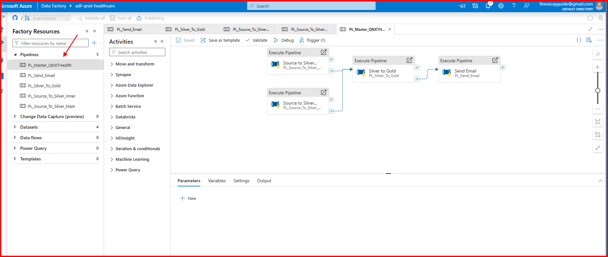

### `PL_Source_To_Silver_Main` — fan out per table (one call per source system)
1. **Read Source Tables List** (Lookup): `select table_id from ctrl.table_config where is_active = 1 and source_system = '<system>'`
2. **Ingest_All_Tables** (ForEach, parallel): per `table_id` → `PL_Source_To_Silver_Inner`;
   on completion writes `IN_PROGRESS` to the audit log, and on failure marks `FAILED` and
   fails the pipeline.

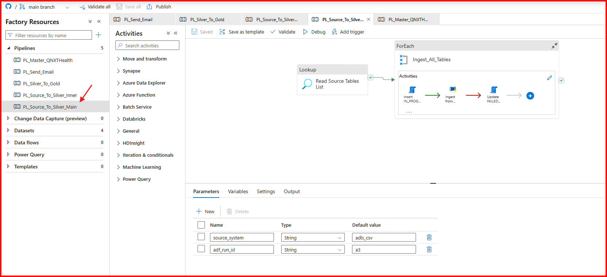
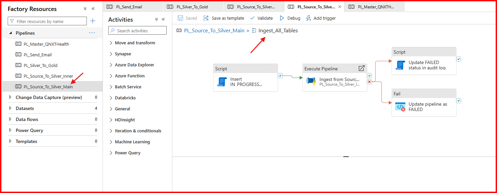

### `PL_Source_To_Silver_Inner` — the generic per-table pipeline (the core of the demo)
Takes `table_id` + `adf_run_id`. Everything below is driven by that table's
`ctrl.table_config` row:
1. **Read Table Details** (Lookup): full config row for the table.
2. **Set start time**: `landing_timestamp` variable (also used to partition the landing path).
3. **Switch on `source_system`**:
   - `neon_postgres` → **Copy** Postgres → Parquet into
     `landing/<source_system>/<table>/<landing_timestamp>/`
   - `adls_csv` → **Copy** Binary CSV `source/<path>` → same landing layout
4. **If load_type ≠ FULL** → read the watermark from `ctrl.watermark` into a variable.
5. **ADLS landing to Bronze** (Databricks notebook `Landing_To_Bronze`): reads the landing
   files for this timestamp via the Unity Catalog volume, adds `landing_timestamp` /
   `insert_timestamp`, appends to `bronze.<table>`; exits early with "no new files" if the
   landing folder is empty. Returns the record count.
6. **Bronze to silver** (Databricks notebook `Bronze_To_Silver`): filters bronze to this
   `landing_timestamp`, then applies the configured strategy —
   **FULL** → overwrite, **APPEND** → append, **MERGE** → Delta `MERGE` on the configured
   `merge_keys` (updates all columns except `insert_timestamp`, inserts new rows; creates
   the table on first load). Returns the record count.
7. **Update SUCCESS in audit log** (Script): sets `status='SUCCESS'`, `end_time`, and
   `records_written` from the notebook's return value.
8. **If load_type ≠ FULL** → advance `ctrl.watermark` to `SYSUTCDATETIME()`.

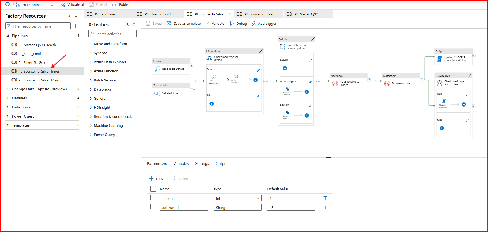

### `PL_Silver_To_Gold`
1. **Read Source Tables List for Gold tables** (Lookup): active `SILVER_TO_GOLD` rows.
2. **ForEach** (parallel): insert `IN_PROGRESS` audit row → run the table's Databricks gold
   notebook → on success update `SUCCESS` + record count; on failure update `FAILED` and
   fail.

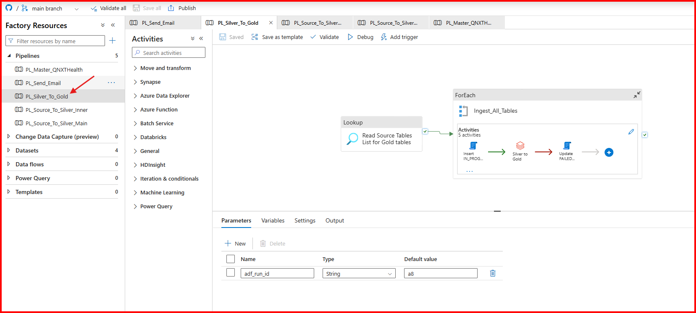
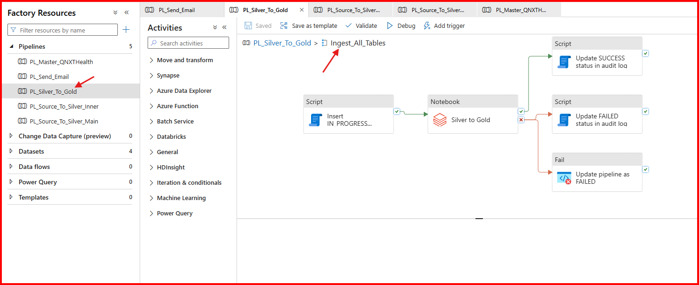

### `PL_Send_Email` — automated status reporting
1. **Read all tables status** (Lookup): all `ctrl.audit_log` rows for this `adf_run_id`.
2. Build the email: subject = `<env> | SUCCESS|FAILED | QNXT MASTER RUN` (FAILED if any
   table failed), header/footer text, and a JSON body containing the full audit result set.
3. **Send Email** (WebActivity POST) to the Logic App URL from the `logic_apps_URL` global
   parameter. The Logic App (`Others/05_ADF_Email_Creation_code/Logic Apps creation.json`)
   builds an HTML table from the results and sends it via Gmail to `email_recipients`.

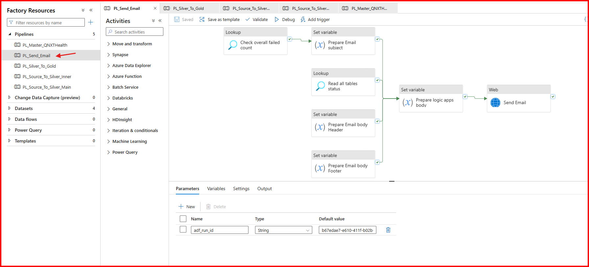

---

## Proof of execution — screenshots from real runs

**Triggered runs (Monitor → Pipeline runs):** full end-to-end executions of
`PL_Master_QNXTHealth` on 10/9/2026 — all stages green, master runs completing in
~6–16 minutes, with per-table child runs underneath.

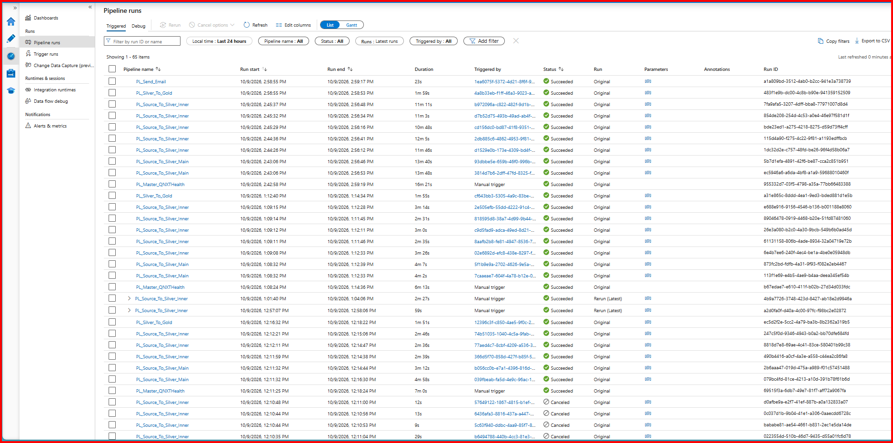

**Debug runs during development:** iterative testing of the individual pipelines
(10/8–10/9/2026) — including the failed runs that were fixed along the way.

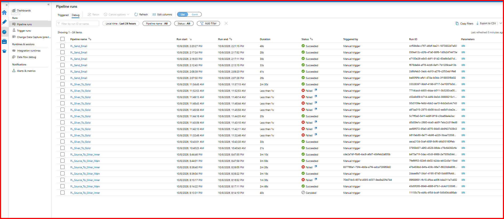

**The actual status email received after a master run** — subject
`DEV | SUCCESS | QNXT MASTER RUN` with the per-table audit table (all 8 tables SUCCESS,
gold record counts 6711 / 5003 / 78):

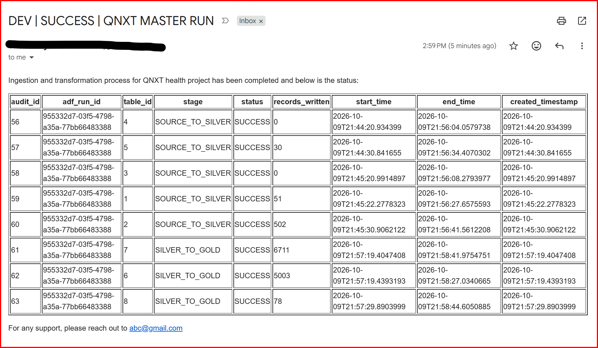

---

## ADF configuration screenshots

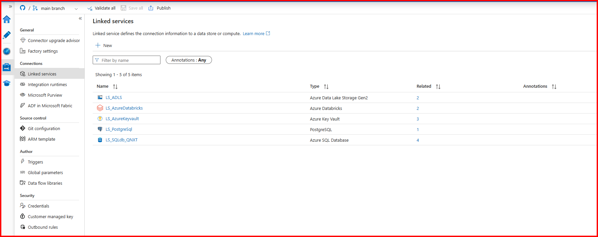
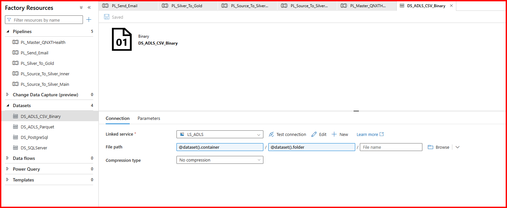
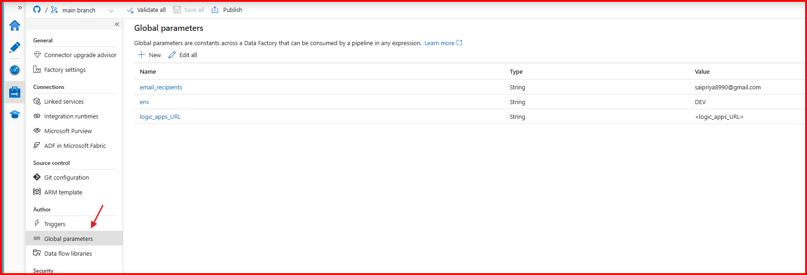

---

## Notebook reference (Databricks)

| Notebook | Widgets in | What it does | Returns |
|---|---|---|---|
| `Landing_To_Bronze` | `source_system`, `table_name`, `landing_timestamp`, `source_file_format` | Reads landing files (CSV with header, else Parquet) from the Unity Catalog volume path, adds audit columns, appends to `bronze.<table>` | Record count |
| `Bronze_To_Silver` | `landing_timestamp`, `table_name`, `load_type`, `merge_key` | Filters bronze to the run's timestamp, stamps `insert/update_timestamp`, writes per `load_type` (FULL overwrite / APPEND / MERGE on keys) | Record count |
| `Calendar Table` | — | One-time: builds `silver.calendar` (1940-01-01 → 2030-12-31) with date keys, year/quarter/month/week parts, day names, weekend flags, period boundaries | — |
| `NB_patient_360` | — | `CREATE OR REPLACE TABLE gold.patient_360`: one row per patient — demographics, hospital + insurance lookups, lab aggregates (total/abnormal/critical counts, last test date), computed age | Record count |
| `NB_hospital_daily_summary` | — | `CREATE OR REPLACE TABLE gold.hospital_daily_summary`: one row per hospital per day — test volumes, patient/doctor counts, abnormal/critical rates, day-over-day change via `LAG()`, enriched with hospital master + calendar | Record count |
| `NB_lab_test_trends` | — | `CREATE OR REPLACE TABLE gold.lab_test_trends`: one row per test per month — volumes, abnormal/critical rates, month-over-month trend via `LAG()` | Record count |
| `Testing_the_data` | — | Ad-hoc validation queries (row counts, spot checks) — dev/testing only | — |

## Gold layer design
The gold tables were designed from the STTM workbook (`Others/03_Gold STTM/sttm_silver_to_gold.xlsx`).
Because each gold table joins/aggregates *multiple* silver tables, the join logic lives in the
notebooks themselves — the `SILVER_TO_GOLD` rows in `table_config` only carry the
`gold_table_name` (source/bronze/silver columns are NULL by design).

## Consumption
- **AI/BI Dashboard** (`Databricks/Dashboards/`): 4 pages — patient insights, hospital
  performance, lab test trends (+ overview), built on the three gold tables (PDF export included).
- **Genie**: a scoped Genie agent plus workspace-wide Genie ONE over the gold tables for
  natural-language Q&A (sample response PDF included).

---

## Setup guide (build order)

1. **Git repo**: create `QNXT-Healthcare-adf-databricks` on GitHub.
2. **ADLS**: create storage account `qnxthealthcarestorage` with `source` and `landing`
   containers; grant the ADF managed identity **Storage Blob Data Contributor**.
3. **Postgres (Neon)**: create project `qnxthealthcare` at neon.com; run
   `Others/01_Sources Data/01_postgres/create_source_tables.sql`; use the connection string
   to configure the ADF linked service.
4. **Key Vault**: create vault, grant ADF (and yourself, temporarily) access, store the
   Postgres password as `postgres-password` (plus the Databricks PAT).
5. **Azure SQL**: create server/database, allow the needed firewall access, run
   `Others/02_Metadata Table Queries/create_control_tables.sql`.
6. **ADF**: create linked services (`LS_ADLS`, `LS_AzureKeyvault`, `LS_PostgreSql`,
   `LS_SQLdb_qnxt`), datasets, then the pipelines; connect the Git repo.
7. **Databricks**: create workspace + cluster; link the Git repo (`Databricks/` folder);
   create the storage credential (`adls-connection`) from the Azure access connector, grant
   it **Storage Blob Data Contributor** on the storage account, create the external location
   (`adls-location`) and the `landing` schema + `landing_volume` volume; create the
   `bronze`, `silver`, `gold` schemas.
8. **Notebooks**: in the Databricks Repos checkout, run `Calendar Table` once, then verify
   `Landing_To_Bronze` / `Bronze_To_Silver` with a manual run.
9. **Email**: deploy the Logic App from `Others/05_ADF_Email_Creation_code/Logic Apps creation.json`,
   put its HTTP URL in the `logic_apps_URL` factory global parameter.
10. **Master pipeline + trigger**: publish, then enable `TGR_QNXT_Health_DAILY`.

## Running a demo end-to-end
1. Seed Postgres (`create_source_tables.sql`) and upload the `Initial_laod` CSVs to `source/`.
2. Run the control-table script on Azure SQL.
3. Trigger `PL_Master_QNXTHealth` → watch bronze → silver → gold populate; check the status email.
4. Run `run_incremental_load.sql` (+ round 2) and drop the `Incremental_load` CSVs.
5. Re-run the master pipeline → only changed/new rows flow (MERGE on `patients`, APPEND on `lab_results`); watermarks advance; audit log + email reflect the delta.

## Onboarding a new source (the metadata-driven payoff)
1. Land the data (or point at the source table).
2. `INSERT` one row into `ctrl.table_config` (+ a `ctrl.watermark` row if APPEND/MERGE).
3. Re-run — no new pipeline, no new notebook, no redeploy.

---

## Security notes
- **No passwords in code**: the Postgres password, SQL DB password, and Databricks PAT are
  all resolved from **Azure Key Vault** at runtime (`AzureKeyVaultSecret` references).
- **No storage keys**: Databricks reaches ADLS through a Unity Catalog storage credential
  backed by an Azure access connector (managed identity), and ADF uses its managed identity.

## Tech stack
Azure Data Factory · Azure Data Lake Storage Gen2 · Azure SQL Database · Azure Key Vault ·
Azure Logic Apps · Databricks · Delta Lake · Unity Catalog · PySpark · Spark SQL ·
PostgreSQL (Neon) · GitHub

*Demo project built following the E2E Azure Data Engineering (ADF + Databricks) tutorial —
extended with a metadata-driven control framework, watermark/merge load strategies,
automated auditing, and email alerting.*
